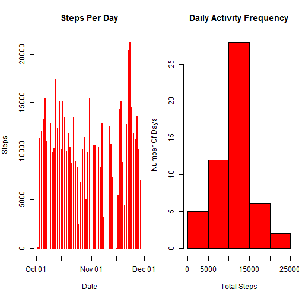
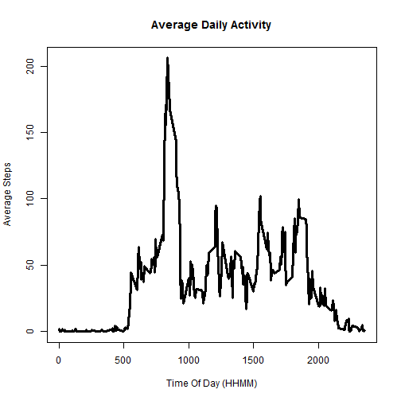
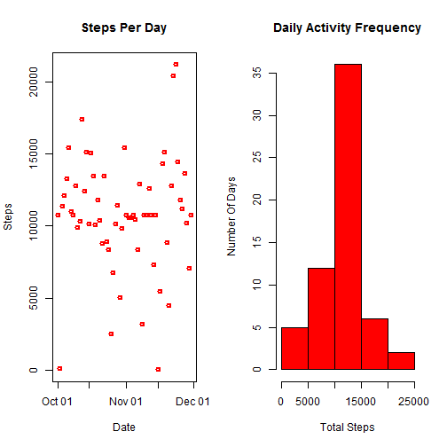
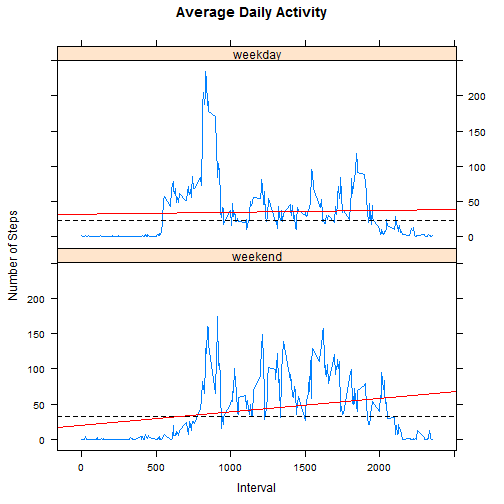

## Loading and preprocessing the data
The dataset for the daily activity is available in [here](https://d396qusza40orc.cloudfront.net/repdata%2Fdata%2Factivity.zip).  We first download the daily activity data and read it into a dataframe.  We then transform/mutate the date variable to Date class. 

```r
# download the file if required
if (!file.exists("activity.csv")) {
        if (!file.exists("activity.zip")) {
                url <- "https://d396qusza40orc.cloudfront.net/repdata%2Fdata%2Factivity.zip"
                download.file(url, "activity.zip")
        }
        unzip("activity.zip")
}

# read data and change date variable to Date class
library(dplyr)
data <- tbl_df(read.csv("activity.csv",header=T))
data <- data  %>% mutate(date = as.Date(date))
```
  
Here is the sample from the downloaded dataset:

```r
data
```

```
## Source: local data frame [17,568 x 3]
## 
##    steps       date interval
## 1     NA 2012-10-01        0
## 2     NA 2012-10-01        5
## 3     NA 2012-10-01       10
## 4     NA 2012-10-01       15
## 5     NA 2012-10-01       20
## 6     NA 2012-10-01       25
## 7     NA 2012-10-01       30
## 8     NA 2012-10-01       35
## 9     NA 2012-10-01       40
## 10    NA 2012-10-01       45
## ..   ...        ...      ...
```

## What is mean total number of steps taken per day?
  
The Daily Activity Histogram is plotted as below.  The missing values have been removed for this purpose.  Then the sum of the steps is taken for each date and using that data the histogram is plotted.  I have created 2 plots:
1. Steps Per Day as histogram
2. Daily Activity Frequency as Histogram


```r
# summarize data by date to calculate the sum of steps per day
daywisedata <- data %>% filter(!is.na(steps)) %>% group_by(date) %>% summarize(stepsperday = sum(steps))
# plot the histograms
par(mfrow=c(1,2), mar = c(5,4,4,0.5))
with(daywisedata, {
        plot(x=date, y=stepsperday, type="h", lwd = 2, col="red", ylab = "Steps", xlab = "Date", main = "Steps Per Day")
        hist(stepsperday, col="red", xlab = "Total Steps", ylab = "Number Of Days", main = "Daily Activity Frequency")
})
```

 
  
It can be seen from the above histogram that the number of days where the activity is between 10000-15000 steps dominates.  Around 65-70% of the days the activity is more than 10000 steps.

The mean and median total number of steps per day are as below:

```r
mean(daywisedata$steps)
```

```
## [1] 10766
```

```r
median(daywisedata$steps)
```

```
## [1] 10765
```

## What is the average daily activity pattern?
Here is the Time Series plot showing the Average Daily Activity pattern:

```r
# summarize data by interval to calculate the verage number of steps per day
timeseriesdata <- data %>% filter(!is.na(steps)) %>% group_by(interval) %>% summarize(average_steps = mean(steps))
# plot the time series data
library(lattice)
xyplot(average_steps ~ interval, data = timeseriesdata, type="l", xlab = "Time Of Day (HHMM)", ylab = "Average Steps", main = "Average Daily Activity")
```

 
  
The maximum number of average steps and the time of day at which the peak is seen is calculated below.  We can see the same in the plot above as well.  The 5-minute interval at 835 hours (or 8:35 AM) shows the maximum average daily activity of ~206 steps.

```r
max(timeseriesdata$average_steps)
```

```
## [1] 206.2
```

```r
timeseriesdata$interval[which(timeseriesdata$average_steps == max(timeseriesdata$average_steps))]
```

```
## [1] 835
```

## Imputing missing values
The total number of missing values in the data set is as below:

```r
length(data$steps[!complete.cases(data)])
```

```
## [1] 2304
```
  
I am using the mean for each interval calulated after removal of missing values to impute data.  The steps are as follows:
- Remove thte missing values.
- calculate the mean per interval.
- Impute the rounded means.

This interval-wise mean has been calculated above in the data frame 'timeseriesdata' and will be used to impute the missing values.  The 288 values in the data frame will be repeated 8 times to impute the 2304 missing values.

```r
imputed.data <- data
imputed.data$steps[!complete.cases(data)] <- round(timeseriesdata$average_steps)
```
  
We then recaclculate the daywise sum of steps and re-plot the histograms as below:

```r
# summarize data by date to calculate the sum of steps per day
imputed.daywisedata <- imputed.data %>% group_by(date) %>% summarize(stepsperday = sum(steps))
# plot the histograms
par(mfrow=c(1,2), mar = c(5,4,4,0.5))
with(imputed.daywisedata, {
        plot(x=date, y=stepsperday, type="h", lwd = 2, col="red", ylab = "Steps", xlab = "Date", main = "Steps Per Day")
        hist(stepsperday, col="red", xlab = "Total Steps", ylab = "Number Of Days", main = "Daily Activity Frequency")
})
```

 

The new mean and median are as below:

```r
mean(imputed.daywisedata$steps)
```

```
## [1] 10766
```

```r
median(imputed.daywisedata$steps)
```

```
## [1] 10762
```
  
- We see that the mean and median have changed slightly but not significantly
- The histogram shows that the number of days where the activity(total steps) are higher have gone up from ~28 to ~36.  The rest of the histogram looks the same.  The pattern of the histogram also remains the same i.e. the number of days are highest for the range 10000-15000 for total steps per day.

## Are there differences in activity patterns between weekdays and weekends?
  
We now want to see the difference in activity patterns between the weekends and weekdays.  For that, we now add the weekday/weekend indicating factor 'daytype' to our data as below.  The new time series data showing the average steps per interval across days can be seen has been displayed.

```r
# add variables day (monday, tues...), daytype (weekday/weekend - factor)
weekend <- c("Saturday","Sunday")
newdata <- data %>% mutate(day = weekdays(date), daytype = !(day %in% weekend)) %>% mutate(daytype = factor(daytype, labels = c("weekend", "weekday")))
# calculate the new time series data by daytype
newtimeseriesdata <- newdata %>% filter(!is.na(steps)) %>% group_by(daytype, interval) %>% summarize(average_steps = mean(steps))
newtimeseriesdata
```

```
## Source: local data frame [576 x 3]
## Groups: daytype
## 
##    daytype interval average_steps
## 1  weekend        0        0.0000
## 2  weekend        5        0.0000
## 3  weekend       10        0.0000
## 4  weekend       15        0.0000
## 5  weekend       20        0.0000
## 6  weekend       25        3.7143
## 7  weekend       30        0.0000
## 8  weekend       35        0.0000
## 9  weekend       40        0.0000
## 10 weekend       45        0.4286
## ..     ...      ...           ...
```
  
The Activity patterns for weekdays and weekends have been calculated and plotted as below:

```r
# plot the panels
xyplot(average_steps ~ interval | daytype, data = newtimeseriesdata, layout = c(1,2), type="l", main = "Average Daily Activity", xlab = "Interval", ylab = "Number of Steps",
        panel = function(x,y,...) {
		panel.xyplot(x,y,...)
		panel.abline(h = median(y), lty = 2)
		panel.lmline(x, y, col = 2)
	})
```

 
  
- We can see from the plots that there is more activity during day time on weekends.  This is shown by higher number of points above 50 between 1000 and 2000 hours (or 10:00AM and 8:00PM) for weekends.
- As shown by the red line, on weekend days, the activity trend is increasing as the day progresses, whereas the increase is less prominent during weekdays.  
- The peak is higher on weekdays (~200+ against ~160 for weekend) at 835 hours (8:35 AM) indicating some morning activity like travel to office.
- The median is slightly higher for the weekends as indicated by the dotted line.

