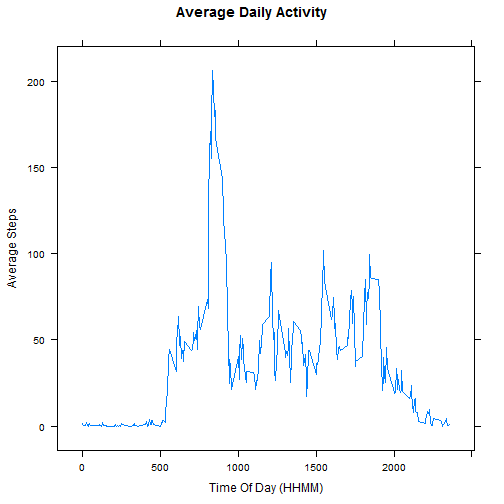
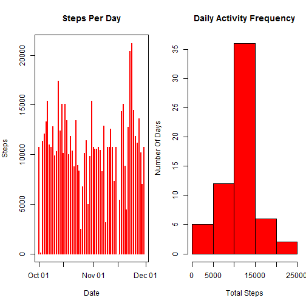

## Loading and preprocessing the data
We first download the daily activity data and read it into a dataframe.  We then change the date variable to Date class. I am using package dplyr.

```r
library(dplyr)

# download and read the file
if (!file.exists("activity.csv")) {
        url <- "https://d396qusza40orc.cloudfront.net/repdata%2Fdata%2Factivity.zip"
        download.file(url, "activity.zip")
        unzip("activity.zip")
}
data <- tbl_df(read.csv("activity.csv",header=T))
data <- data  %>% mutate(date = as.Date(date))
```

  
Here is the sample of the dataset:

```r
data
```

```
## Source: local data frame [17,568 x 3]
## 
##    steps       date interval
## 1     NA 2012-10-01        0
## 2     NA 2012-10-01        5
## 3     NA 2012-10-01       10
## 4     NA 2012-10-01       15
## 5     NA 2012-10-01       20
## 6     NA 2012-10-01       25
## 7     NA 2012-10-01       30
## 8     NA 2012-10-01       35
## 9     NA 2012-10-01       40
## 10    NA 2012-10-01       45
## ..   ...        ...      ...
```

## What is mean total number of steps taken per day?
The Daily Activity Histogram is plotted as below.  The missing values have been removed for this purpose.

```r
daywisedata <- data %>% filter(!is.na(steps)) %>% group_by(date) %>% summarize(stepsperday = sum(steps))
with(daywisedata, hist(stepsperday, col="red", xlab = "Total Steps", ylab = "Number Of Days", main = "Daily Activity Histogram"))
```

 
  
The mean and median total number of steps per day are as below:

```r
mean(daywisedata$steps)
```

```
## [1] 10766
```

```r
median(daywisedata$steps)
```

```
## [1] 10765
```

## What is the average daily activity pattern?
Here is the Time Series plot showing the Average Daily Activity pattern:

```r
timewisedata <- data %>% filter(!is.na(steps)) %>% group_by(interval) %>% summarize(average_steps = mean(steps))
with(timewisedata, plot(x = interval, y = average_steps, type="l", lwd=3, xlab = "Time Of Day (HHMM)", ylab = "Average Steps", main = "Average Daily Activity"))
```

 
  
The maximum number of average steps and the time of day at which the peak is seen is calculated below.  We can see that the 5-minute interval at 835 hours (or 8:35 AM) shows the maximum average daily activity.

```r
max(timewisedata$average_steps)
```

```
## [1] 206.2
```

```r
timewisedata$interval[which(timewisedata$average_steps == max(timewisedata$average_steps))]
```

```
## [1] 835
```

## Imputing missing values
The total number of missing values in the data set is as below:

```r
length(data$steps[!complete.cases(data)])
```

```
## [1] 2304
```
  
I am using the mean for that interval to impute values.  The interval-wise mean calculated above(timewisedata) will be used to impute the missing values.  The 288 values in the data frame will be repeated 8 times to impute the 2304 values.

```r
imputed.data <- data
imputed.data$steps[!complete.cases(data)] <- round(timewisedata$average_steps)
```
  
We then recaclculate the daywise sum of steps and re-plot it as below:

```r
imputed.daywisedata <- imputed.data %>% group_by(date) %>% summarize(stepsperday = sum(steps))
with(imputed.daywisedata, hist(stepsperday, col="red", xlab = "Total Steps", ylab = "Number Of Days", main = "Daily Activity Histogram with Imputed Data"))
```

 

The new mean and median are as below:

```r
mean(imputed.daywisedata$steps)
```

```
## [1] 10766
```

```r
median(imputed.daywisedata$steps)
```

```
## [1] 10762
```
  
- We see that the mean and median have changed slightly but not significantly
- The histogram shows that the number of days where the activity(total steps) are higher have gone up from ~28 to ~36.  The rest of the histogram looks the same.  The pattern of the histogram also remains the same i.e. the number of days are highest for the range 10000-15000 for total steps per day.

## Are there differences in activity patterns between weekdays and weekends?
  
We now want to see the difference in activity patterns between the weekends and weekdays.  For that, we now add the weekday/weekend indicating factor to our data as below:

```r
newdata <- data %>% mutate(weekday = weekdays(date))
weekend <- c("Saturday","Sunday")
newdata <- imputed.data %>% mutate(day = weekdays(date), weekday = !(day %in% weekend)) %>% mutate(weekday = factor(weekday, labels = c("weekend", "weekday")))
newtimewisedata <- newdata %>% filter(!is.na(steps)) %>% group_by(weekday, interval) %>% summarize(average_steps = mean(steps))
newtimewisedata
```

```
## Source: local data frame [576 x 3]
## Groups: weekday
## 
##    weekday interval average_steps
## 1  weekend        0         0.250
## 2  weekend        5         0.000
## 3  weekend       10         0.000
## 4  weekend       15         0.000
## 5  weekend       20         0.000
## 6  weekend       25         3.500
## 7  weekend       30         0.125
## 8  weekend       35         0.125
## 9  weekend       40         0.000
## 10 weekend       45         0.500
## ..     ...      ...           ...
```
  
The Activity patterns for weekdays and weekends have been calculated and plotted as below:

```r
library(lattice)
xyplot(average_steps ~ interval | weekday, data = newtimewisedata, layout = c(1,2), type="l", main = "Average Daily Activity Pattern", xlab = "Interval", ylab = "Number of Steps",
        panel = function(x,y,...) {
		panel.xyplot(x,y,...)
		panel.abline(h = median(y), lty = 2)
		panel.lmline(x, y, col = 2)
	})
```

 
  
- We can see from the plots that there is more activity during the day on the weekends and it is also more distributed.
- The peak is higher on weekday (~200+ against ~160 for weekend) at 835 hours (8:35 AM) indicating some morning activity like travel to office.
- The median is slightly higher for the weekends as indicated by the dotted line.
- As shown by the red line, the activity increases as the day progresses on weekends, whereas the increase is less prominent during weekdays.  

